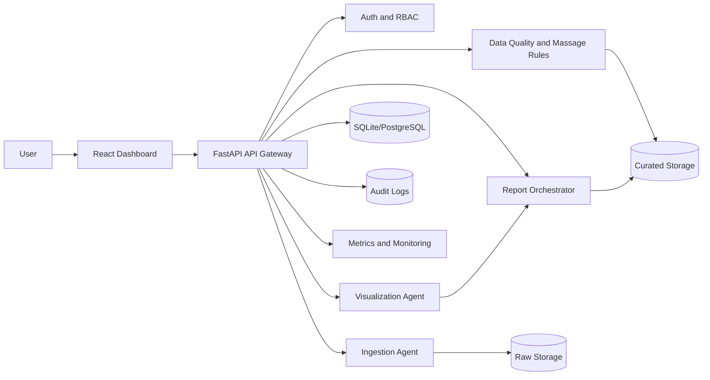

# System Architecture Blueprint and Detailed Design

## 1. Architecture Diagram

## 2. Module design with functional specs

### 2.1 Ingestion Agent

- Input: CSV, Excel, XML file or SQL query.
- Output: normalized curated table, profile and quality scores.
- Methodology: parse -> standardize names -> infer datatypes -> deduplicate -> quality scoring.

### 2.2 Visualization Agent

- Input: curated data profile.
- Output: auto-suggested chart/KPI definitions with confidence and reasons.
- Methodology: rule-assisted ML-ready recommendation strategy.

### 2.3 Report Orchestrator

- Input: selected period and profile.
- Output: dynamic report specification JSON and period aggregates.
- Methodology: period resampling (daily, biweekly, monthly, quarterly, half-yearly, yearly).

### 2.4 API Layer

- Input: frontend requests.
- Output: secure CRUD operations and dashboard payloads.
- Methodology: FastAPI, schema validation, JWT, audit events.

### 2.5 Dashboard Widgets (React)

- Input: report specs, widget configurations, user preference changes.
- Output: configurable visual analytics board.
- Methodology: chart rendering + persisted widget customization.

## 3. Functional requirements

1. Support CSV/Excel/XML/SQL ingestion.
2. Automatically massage and profile data.
3. Auto-generate dynamic reports with suggested chart types.
4. Enable configurable widgets with color and pattern customization.
5. Expose secure CRUD APIs for datasets, reports, widgets.
6. Maintain auditability and traceability.

## 4. Non-functional requirements

1. Performance: Dashboard response under 2.5 seconds for summarized views.
2. Reliability: API and ingestion flows should complete with high success rate.
3. Security: JWT, RBAC scaffold, audit logs, input validation.
4. Scalability: Agent modules separated for future background worker scaling.
5. Usability: simple upload-first experience and automatic report generation.

## 5. Ethical and security principles in architecture

### 5.1 Risk identification

1. Privacy exposure risk from user-uploaded e-commerce datasets.
2. Access control risk from unauthorized API access.
3. Algorithmic fairness risk from biased recommendation heuristics.

### 5.2 Module-level safeguards

1. Data minimization and normalization in ingestion layer.
2. JWT auth and role checks in API dependencies.
3. Audit logs for all key actions to provide accountability.
4. Explainable suggestions with reasons and confidence values.

### 5.3 Key aspects

- Data protection: encrypted transport in deployment, retention policy.
- Authentication: token-based access, role-based permissions.
- User consent: upload UI + policy notice (to be added in production UI).
- Fairness: model feedback loop and subgroup validation checks.

### 5.4 Concrete ethical-security example

If customer-level data is uploaded:

1. Remove direct identifiers during massaging.
2. Restrict report access to authenticated users.
3. Log all report generation actions with actor and timestamp.
4. Evaluate recommendation distribution across regions to detect skew.

Standards linkage: GDPR principles for minimization and lawful processing, ISO 27001 controls for access/logging, and OWASP Top 10 for secure input and access control hardening.
