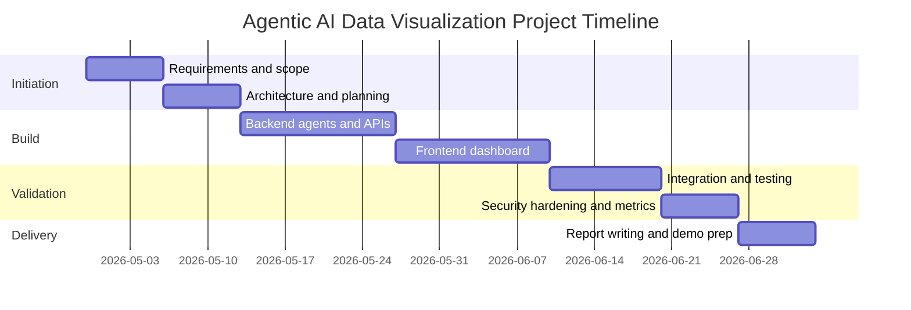

# Project Proposal, Planning, and Technical Report Draft

## 1. Defining the problem statement

### a) Problem context

E-commerce organizations often struggle to convert heterogeneous data into timely insights due to manual preprocessing and report building. This project addresses data analytics automation with secure agentic workflows.

### b) Stakeholders

- Decision-makers requiring timely dashboards.
- Analysts needing reduced manual preparation.
- Security/compliance teams responsible for governance.
- Developers maintaining scalable IT solutions.

### c) Problem statement

Develop an agent-driven, secure, and scalable web platform that autonomously ingests heterogeneous e-commerce datasets, massages and analyzes data, and generates dynamic configurable visual reports with minimal user intervention.

## 2. Scope, goals, outcomes

### a) Scope

In-scope:

- Multi-source ingestion (CSV, SQL, Excel, XML).
- Dynamic report generation and configurable widgets.
- CRUD APIs and security baseline.

Out-of-scope (phase 1):

- Multi-cloud deployment and streaming event pipelines.

### b) SMART goals

1. Deliver ingestion for four source types.
2. Deliver automatic period-based report generation.
3. Enable user widget customization and persistence.
4. Implement baseline security and audit controls.
5. Provide report-ready documentation and CI checks.

### c) Expected outcomes

- Working prototype and architecture evidence.
- Technical report with references.
- Performance/stability observations.

## 3. Ethical and security implications

### a) Ethical issues

- Privacy risks in uploaded customer data.
- Consent and purpose limitation concerns.
- Fairness and representational bias in report recommendations.

### b) Security implications

- Upload injection and malicious file content risk.
- Broken access control risk in API endpoints.
- Data leakage from weak logging or storage controls.

### c) Mitigation measures

- Data minimization and pseudonymization policies.
- JWT, RBAC checks, and audit logs.
- Encryption in transit and secure deployment controls.
- Periodic fairness and quality reviews.

## 4. Project planning tools

### a) Gantt chart (Mermaid)

### b) Resource justification table

| Resource | Purpose | Justification |
|---|---|---|
| FastAPI | Backend API | Rapid development, typed contracts |
| pandas | Data prep | Strong tabular processing |
| scikit-learn | ML support | Baseline recommendation modeling |
| React + Vite | Frontend UI | Fast and modular component workflow |
| Recharts | Visualization | Lightweight interactive charts |
| SQLite/Postgres | Metadata store | Persist datasets/reports/widgets/audits |
| GitHub Actions | CI/CD | Automated tests and build checks |

### c) Feasibility checklist

| Feasibility area | Assessment | Notes |
|---|---|---|
| Technical | High | Existing stack is mature and documented |
| Operational | Medium-High | Requires user onboarding and dataset policies |
| Economic | High | Open-source components reduce costs |
| Schedule | Medium | Controlled by phased milestones |

## 5. Version control and collaboration

1. Initialize Git repository with main and development branches.
2. Create feature branches per module.
3. Use conventional, clear commit messages.
4. Use pull requests for reviews and controlled merges.

## 6. Technical report structure

### Preliminary sections

- Title page
- Abstract
- Acknowledgements
- Table of contents
- List of tables and figures
- Abbreviations and symbols

### Core chapters

- Introduction
- Literature review
- System design and methodology
- Conclusion and future work

### Additional sections

- References (APA 7)

## 7. CI/CD reflection summary

- CI runs tests and static checks on each commit/PR.
- CD enables controlled releases with validation gates.
- Tool options: GitHub Actions, Jenkins, GitLab CI/CD, Azure DevOps.

## 8. Implementation progress and challenge reflection

Milestones achieved:

1. Full backend API and agent scaffolding completed.
2. Frontend upload-to-dashboard flow implemented.
3. Widget customization and persistence completed.
4. Baseline tests and CI workflow added.

Challenges and resolutions:

1. Handling mixed datatypes from heterogeneous files.
   - Resolved via staged inference rules and profile metadata.
2. Bridging period-based aggregate data with generic widgets.
   - Resolved via report spec with normalized aggregation payloads.
3. Securing CRUD routes without overcomplication.
   - Resolved using centralized dependency-based token checks.

## 9. Inline in-text citations

The project scope and milestone planning follow lightweight project management practices (Oguz, 2025; Bergmann, 2021). The modular architecture approach is aligned with software design best practices for maintainability and scaling (Davies, 2024; Letaw, 2024). Ethical and security controls incorporate accepted guidance around privacy, access control, and vulnerability reduction (GDPR, 2016; ISO/IEC 27001, 2022; OWASP, 2021). CI/CD adoption reflects modern software engineering workflows for rapid and reliable releases (Red Hat, 2025; Narasimhan et al., 2025).

## 10. References (APA 7 subset)

- Bergmann, F. (2021, March 17). My favorite open source project management tools. Opensource.com. https://opensource.com/article/21/3/open-source-project-management
- Davies, S. (2024). Blueprints: Creating, describing, and implementing designs for larger-scale software projects (Version 2.5). University of Mary Washington.
- ISO/IEC. (2022). ISO/IEC 27001:2022 Information security, cybersecurity and privacy protection.
- Oguz, A. (2025). Project Management (2nd ed.). MSL Academic Endeavors. https://pressbooks.ulib.csuohio.edu/projectmanagement2ndedition/
- OWASP Foundation. (2021). OWASP Top 10: The ten most critical web application security risks. https://owasp.org/www-project-top-ten/
- Red Hat. (2025, April 29). What is DevOps? https://www.redhat.com/en/topics/devops/what-is-devops
- Narasimhan, A., Sham, R., & Subramanian, H. (2025, October 15). A beginner's handbook to DevOps.
- Regulation (EU) 2016/679 (General Data Protection Regulation).
